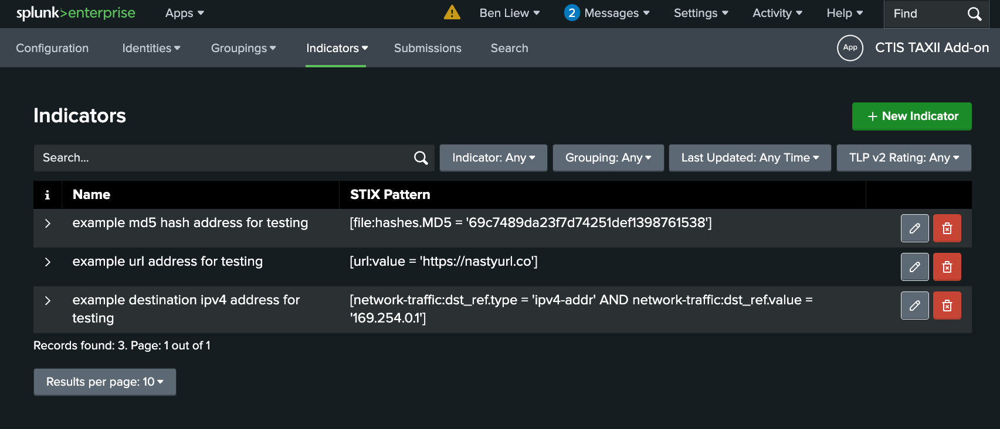

# CTIS TAXII Splunk App Documentation

This Splunk app provides threat intelligence sharing capabilities to support the ASD's CTIS program.
This app allows security teams to curate IoCs (Indicators of Compromise) which can be submitted as STIX v2.1 bundles via the TAXII v2.1 protocol.

## Supporting Documentation
- [Oasis Open - Introduction to STIX](https://oasis-open.github.io/cti-documentation/stix/intro.html)
- [Oasis Open - Introduction to TAXII](https://oasis-open.github.io/cti-documentation/taxii/intro.html)
- [TAXII v2.1 Specification](https://docs.oasis-open.org/cti/taxii/v2.1/os/taxii-v2.1-os.html)
- [STIX v2.1 Specification](https://docs.oasis-open.org/cti/stix/v2.1/os/stix-v2.1-os.html)
- [Australian Signals Directorate’s Cyber Security Partnership Program](https://www.cyber.gov.au/partnershipprogram)

## Example Image

## Getting Started
### Installation
See [Installation](installation.md)