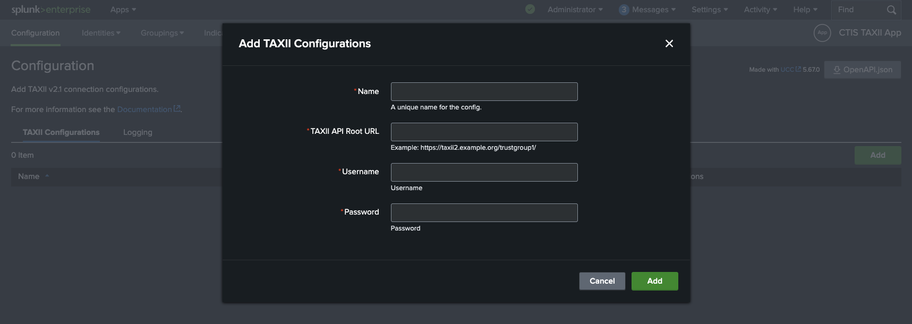

# Configuration
Start by configuring the TAXII server that will be used to submit STIX bundles.

Navigate to the **Configuration** tab in the app.

Click on the **Add** button to add a new TAXII server configuration.

Clicking on **Add** will verify the connection to the TAXII server including network connectivity and authentication.

- Network Requirements (firewall restrictions)
  - Obviously, the TAXII server must be reachable from the Splunk instance

