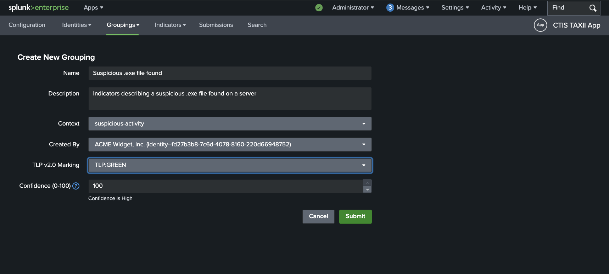

# Groupings
## Creating Groupings
Reference: [STIX Grouping SDO](https://docs.oasis-open.org/cti/stix/v2.1/os/stix-v2.1-os.html#_t56pn7elv6u7)

To create a new Grouping, click on the **Groupings** tab in the app, then click on the **New Grouping** button in the navigation dropdown.

This will take you to the **Create New Grouping** page where you can fill in the details for the new Grouping.

Fill in the required fields. The `Created By` dropdown will be populated with the identities that have been created in the app.

For more information on TLP Rating

As an example, a Grouping might look like this:

## Viewing / Searching Groupings
The viewing and searching of Groupings is similar to that of [Identities](identities.md).

The search bar lets you search for Groupings by name, description, Grouping ID and context fields.

There are also dropdown filters available for Grouping ID, Last Updated and Last Submitted.

