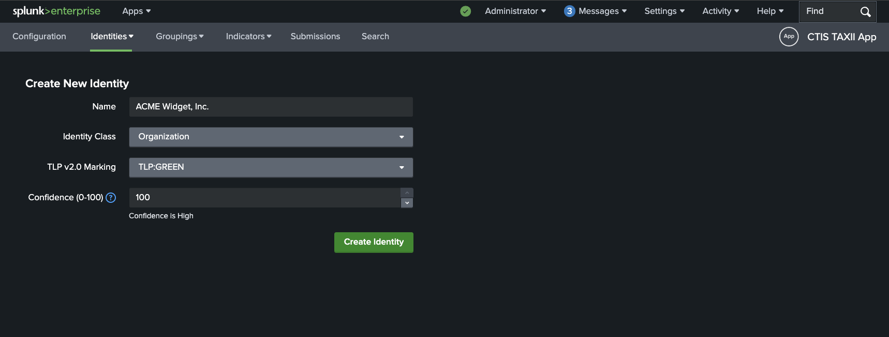

# Identities
## About
In the context of this app, Identity objects are used to represent who has created a Grouping or Indicator.
When creating a Grouping, the `Created By` dropdown field will be populated with the identities that have been created in the app.
A Grouping's `Created By` Identity is used to automatically populate the `created_by_ref` field for the Indicator SDOs that belong to the Grouping.

Attribution of an Indicator to a particular Threat Actor identity is not currently supported in this app.

## Creating Identities
Reference: [STIX Identity SDO](https://docs.oasis-open.org/cti/stix/v2.1/os/stix-v2.1-os.html#_wh296fiwpklp)

To create a new Identity, click on the **Identities** tab in the app, then click on the **New Identity** button in the navigation dropdown.

This will take you to the **Create New Identity** page where you can fill in the details for the new Identity.

Fill in the required fields.
Generally, the default `Confidence` value of 100 is appropriate, since this represents the identity creating the SDOs.

An example Identity might look like this:

Click on the **Create Identity** button to save the new Identity.

## Viewing / Searching Identities
You can view and search for existing Identities by clicking on the **Identities** tab in the app, and then **Identities** in the navigation dropdown.

As an example:

You can click on the `>` button at the start of each record row to expand the Identity record and view its details.

You can search for Identities by Name, Identity Class or Identity ID.
If only one search result exists, the record will auto-expand to show the details of the Identity.

Note that when you create an Identity, the `Identity ID` is automatically generated and includes a UUID.

If you have many Identities, you can use the pagination controls at the bottom of the page to navigate through the records.
You can also adjust the results per page using the dropdown.

## Editing Identities
TODO

## Deleting Identities
TODO
