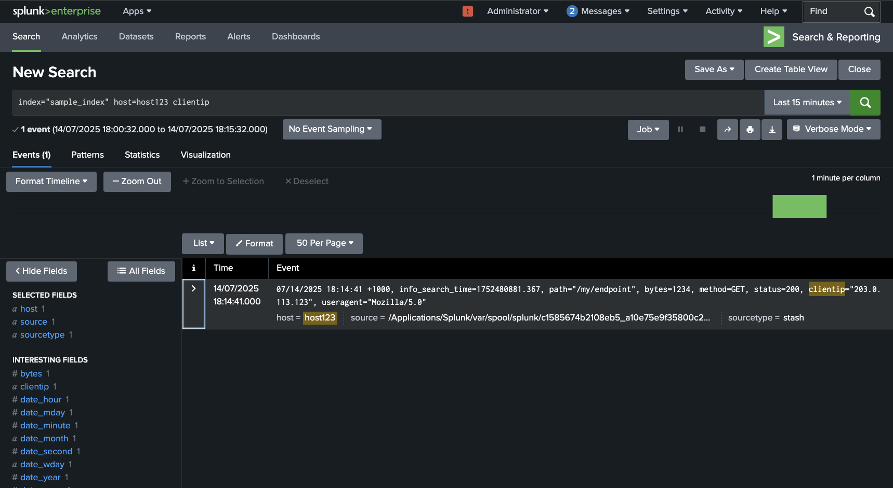
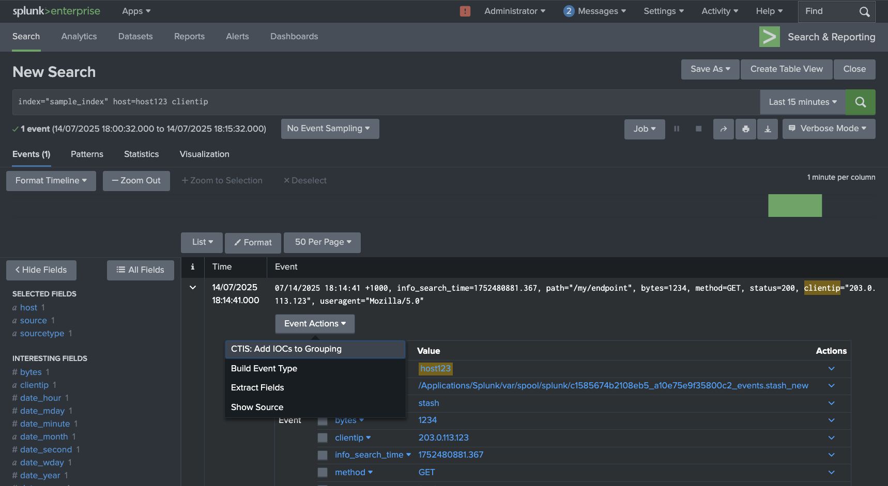
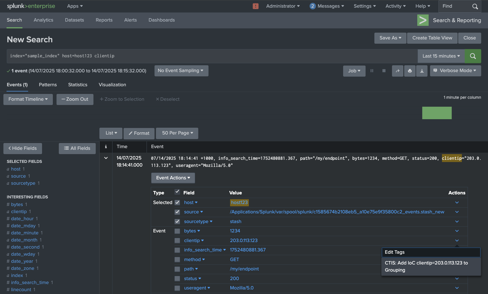
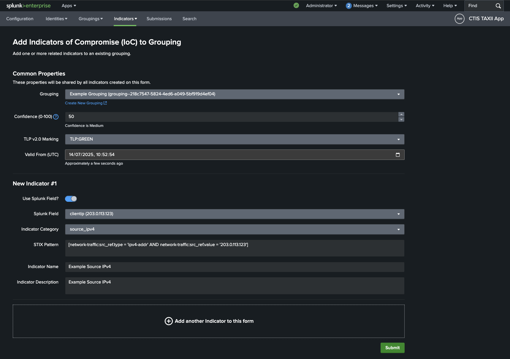
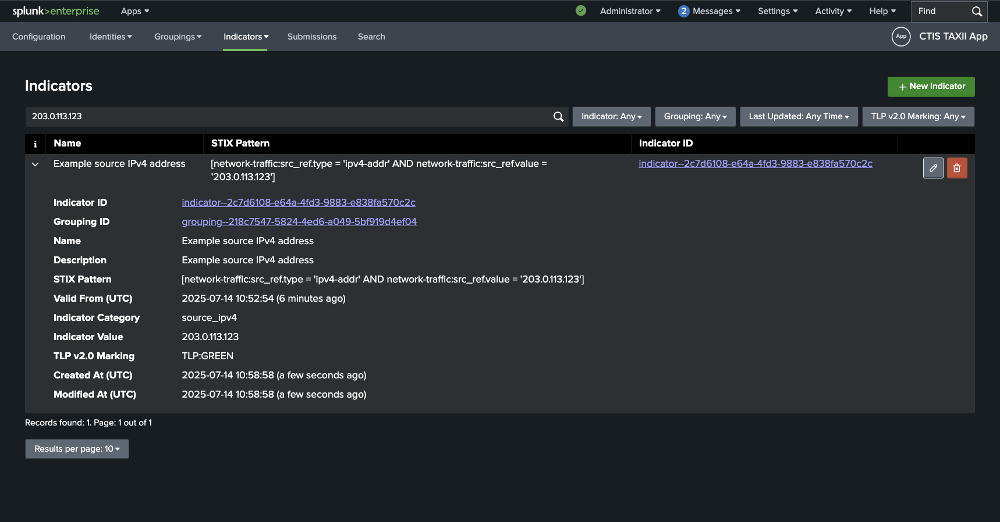

# Indicators
## About Indicators
Reference: [STIX Indicator SDO](https://docs.oasis-open.org/cti/stix/v2.1/os/stix-v2.1-os.html#_muftrcpnf89v)

## New Indicator via Workflow Action
You can feed a Splunk event or field value into the New Indicator form via a workflow action.

### Event Workflow Action
A workflow action can be triggered from Splunk's Search page on an event or field.

For example, given this event, click on the `>` button to expand the event:

Then, click on `Event Actions` to list available workflow actions. Then click on `CTIS: Add IOCs to Grouping`. This will open the form to add new Indicators to a Grouping

### Field Workflow Action
Alternatively, you can trigger the workflow action from a field in the event:

Click on the Actions `⌄` downward-caret field button to show the available field level workflow actions.

Then click on `CTIS: Add IOC field=value to Grouping`:

## New Indicator Form
Once the `Add Indicators of Compromise (IoC) to Grouping` form is opened via workflow action, fill in the Common Properties section with your required `Grouping`, `Confidence`, `TLP Marking` and `Valid From` timestamp.

Then, proceed to fill in the details for the new Indicator.

The `Splunk Field` dropdown becomes populated with field values from the event which was used to trigger the workflow action.

The [Indicator Cateogry](#indicator-category) dropdown and the `Splunk Field` dropdown are used to generate a suggested [STIX Pattern](#stix-patterns) for the Indicator.

As an example below, see that the Splunk field `clientip` has been selected which uses the value `203.0.113.123` to feed into generating a STIX pattern describing a Source IPv4 Address.

Note that you can manually edit the STIX Pattern if you wish. Validation is performed to ensure that the pattern syntax is valid.

Finally, populate a `Indicator Name` and `Indicator Description` for the Indicator.

Once you are done, click on `Submit` to create the Indicator.

Optionally, you can add multiple indicators by clicking on the `Add another Indicator to this form` button at the bottom of the form.

## Indicator Category
The `Indicator Category` dropdown is used to classify the type of Indicator you are creating and helps with the app's auto-generation of a STIX Pattern via a pattern template.
This field is not a part of the STIX specification and is not included in the STIX SDO generated for submission to a TAXII server.

The list of available categories includes templates for common IoCs such as IPv4 Address, IPv6 Address, Domain Name, Email Address, File Hash, and URL.

If you believe a useful Indicator Category is missing, please [raise an issue on Github](../index.md#support).

## STIX Patterns
For more information on STIX Patterns, see the [STIX documentation](https://docs.oasis-open.org/cti/stix/v2.1/os/stix-v2.1-os.html#_e8slinrhxcc9).

For examples of STIX patterns see [here.](https://docs.oasis-open.org/cti/stix/v2.0/cs01/part5-stix-patterning/stix-v2.0-cs01-part5-stix-patterning.html#_Toc496717759)

### Note on Unicode Characters
Note that specifying Unicode characters with `\uXXXX` syntax is not supported in the app.
You can however, paste the Unicode character you require in the indicator value field or modify the STIX Pattern directly.

For any non human-readable characters such as <https://unicode-explorer.com/c/200B>, it is recommended to note these in the `description` field of the Indicator.

## Viewing / Searching Indicators
Again, viewing and searching Indicators is similar to the process for [Identities](identities.md) and [Groupings](groupings.md).

Fields that you can search include: `Name`, `Description`, `STIX Pattern`, `Indicator Value`, `Indicator Category`, `Indicator ID` and `Grouping ID`.

There are search filter dropdowns for `Indicator ID`, `Grouping ID`, `Last Updated` and `TLP v2.0 Marking`.

