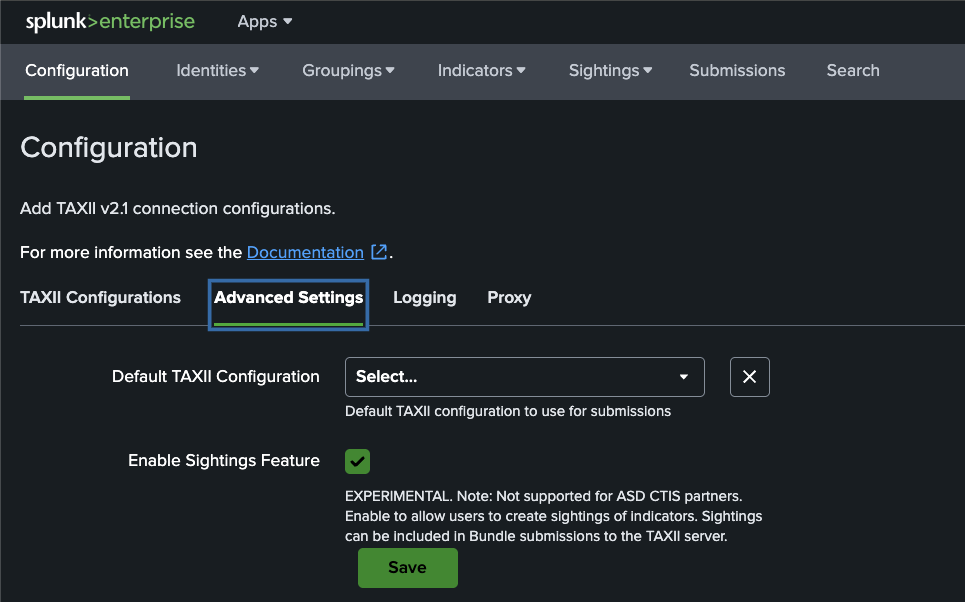
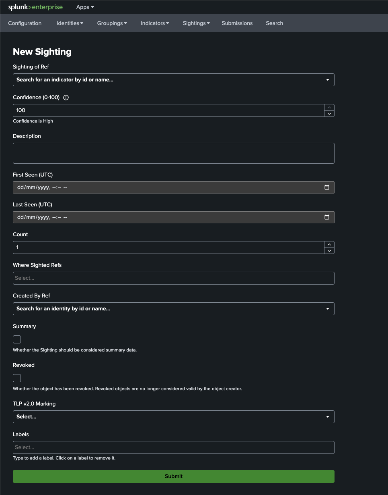
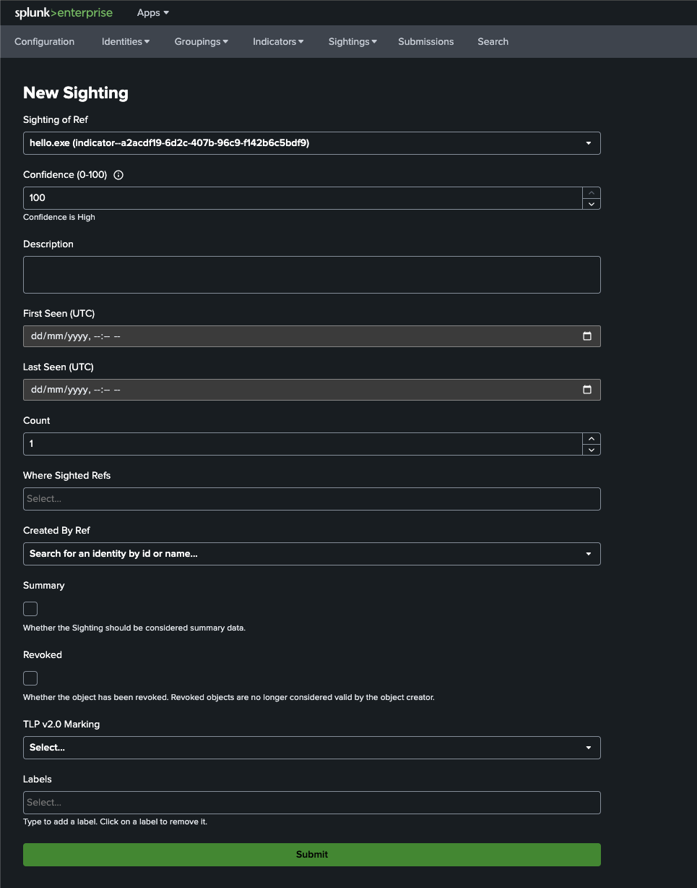
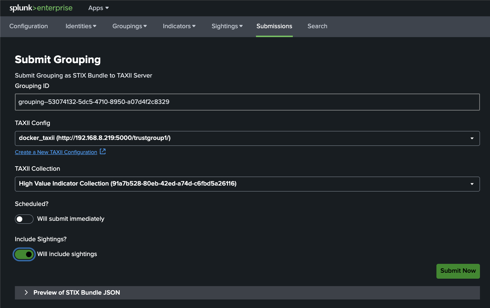

# Sightings

## About
Sightings can be created to represent the observation of an Indicator.

STIX Reference: [https://docs.oasis-open.org/cti/stix/v2.1/stix-v2.1.html#sighting](https://docs.oasis-open.org/cti/stix/v2.1/stix-v2.1.html#sighting)

## Enable Feature Toggle
By default, the Sightings feature is disabled in the app.

!!! warning "Warning: Not for ASD CTIS Partners"

    This feature is not intended for ASD CTIS partners. Please do not enable it if you are an ASD CTIS partner.

To enable it, go to the **Configuration** tab in the app, then click on **Advanced Settings**.
Then, toggle the 'Enable Sightings Feature' checkbox and click **Save**.

## Creating Sightings
To create a new Sighting, click on the **Sightings** tab in the app, then click on the **New Sighting** button in the navigation dropdown.

At a minimum, Sighting of Ref should be populated with the indicator which is sighted.

## Bundle Submission to TAXII Server
When the Sightings feature is enabled, on the **Submit Grouping** page, you will see an option to include Sightings in the submission.
The 'STIX Bundle JSON' preview is updated to reflect whether Sightings are included or not.

