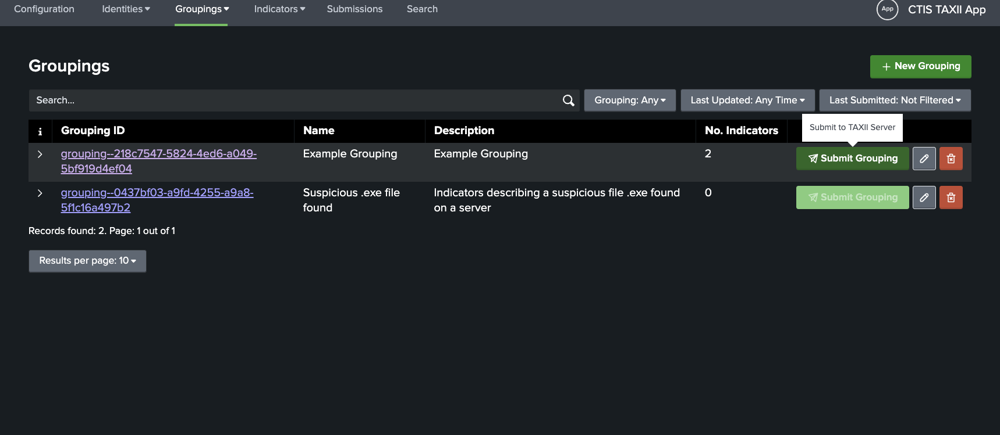
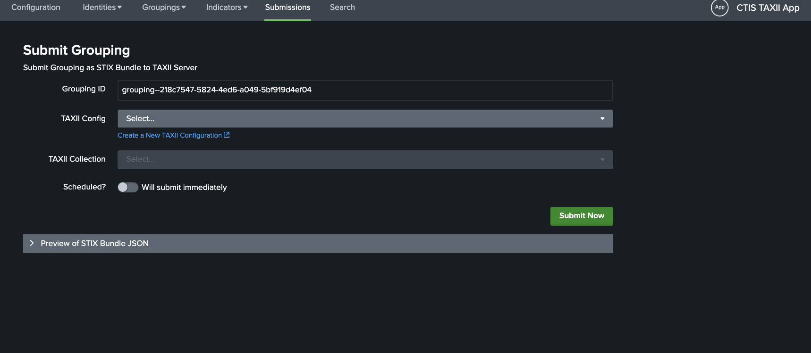
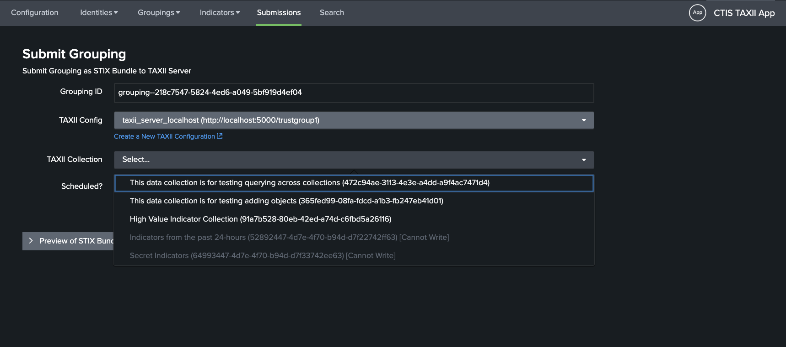
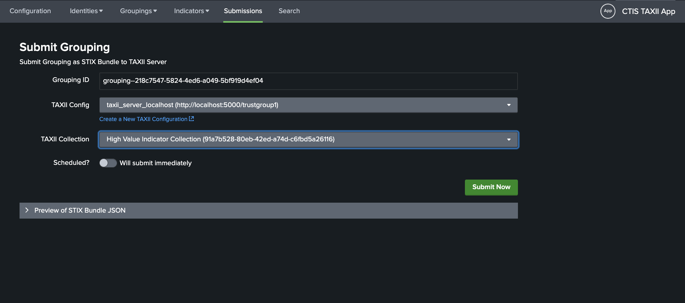
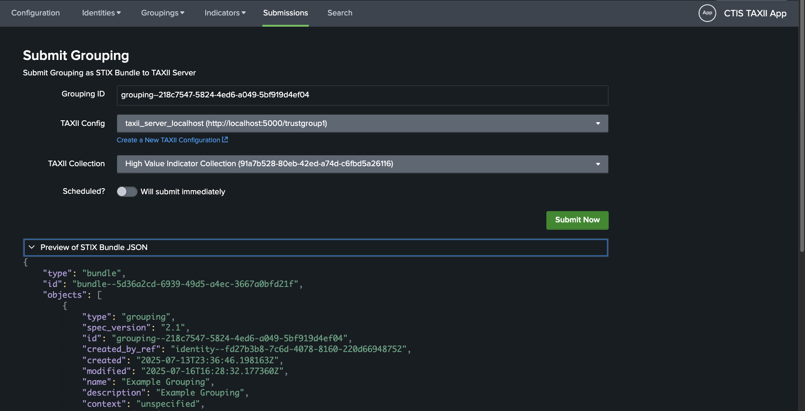
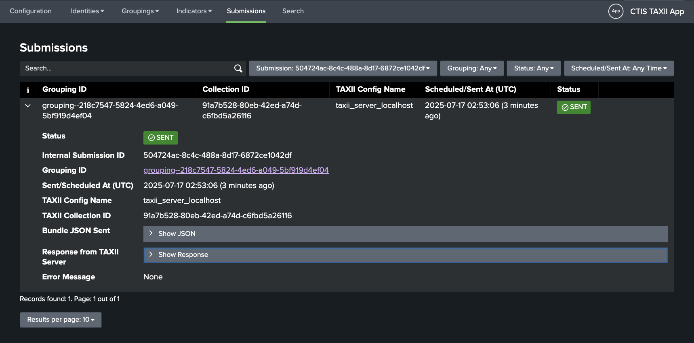
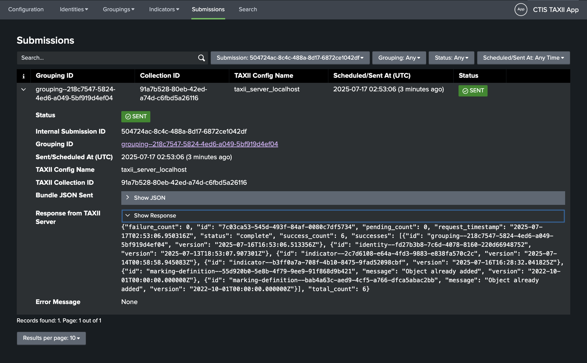
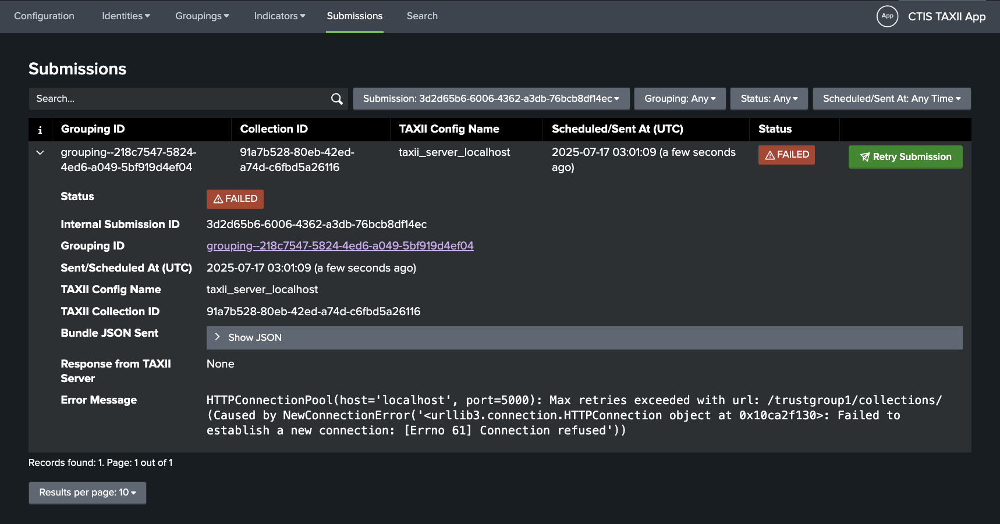
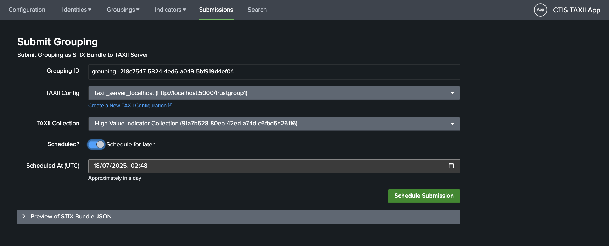
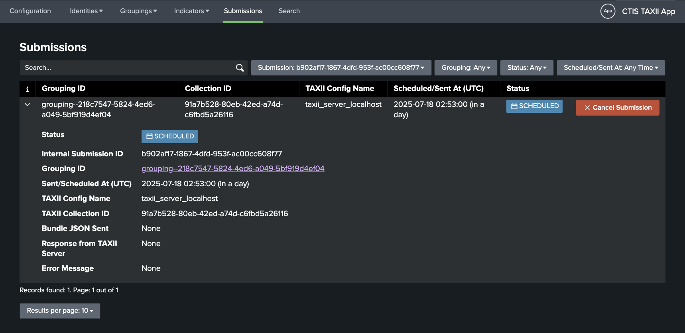

# Submissions
## Submit a Grouping to a TAXII Server
To initiate a submission of a Grouping to a TAXII server, click on the **Submit Grouping** button in the Grouping's row.
Note that you will not be able to submit a Grouping which has no associated Indicators.

You will be taken to the **Submit Grouping** page where you can fill in the details for the submission.

After choosing an existing TAXII server configuration, you need to select a collection to submit the Grouping to.
Note that collections which you do not have [write permission](https://docs.oasis-open.org/cti/taxii/v2.1/os/taxii-v2.1-os.html#_Toc31107540) for will be greyed out.

If you would like to, you can preview the STIX Bundle JSON payload that will be submitted to the TAXII server.
Click on the **Preview of STIX Bundle Payload** button to expand the preview.

### Submit Immediately
If you would like to submit the Grouping now, click on the **Submit Now** button.

This will trigger a POST request from the Splunk server to the [Add Objects endpoint](https://docs.oasis-open.org/cti/taxii/v2.1/os/taxii-v2.1-os.html#_Toc31107540), with
the STIX Bundle JSON as payload.

You will be redirected to a page to view the submission. This which will show whether the submission was successful or not.

An example successful submission may look like this:

You can see the TAXII server's response by exapnding the **Show Response** section:

An example failed submission may look like this:

### Scheduled Submission
If you would like to schedule the submission for a later time, toggle the switch labelled `Scheduled?` as enabled.
This will display a date and time picker to select the submission time.

Once you have selected the time, click on the **Schedule Submission** button to schedule the submission.

Note that the scheduled Splunk saved search called `ctis_taxii_scheduler` handles the submission of scheduled submissions.
You can adjust the `cron_schedule` of this saved search as needed. By default, this job runs every minute.

Therefore, the `Scheduled At (UTC)` datetime is the earliest at which the submission will be made.

### Cancel a Scheduled Submission
To cancel a scheduled submission, click on the **Cancel Submission** button in the Grouping's row.
You will be prompted to confirm the cancellation.

