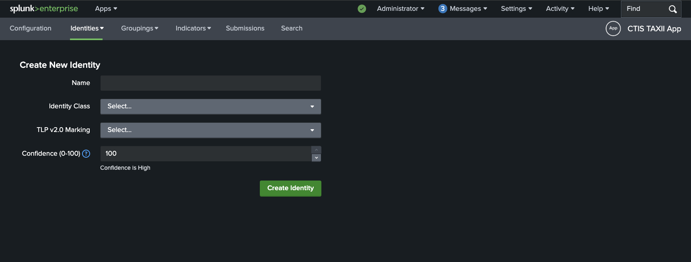
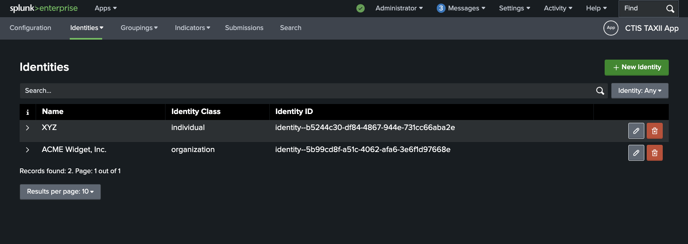
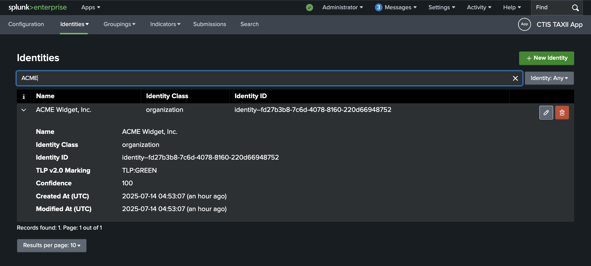

# User Guide - Curating and Sharing CTI
Assumes that the app has been [installed](installation.md) and [configured](configuration.md) already.

This guide covers how to use the app to curate IoCs (Indicators of Compromise) for cyber threat intelligence (CTI) sharing,
and how to submit groupings of IoCs to a TAXII v2 server as a STIX v2 Bundle.

The app provides a UI for creating and managing records that represent Identity, Grouping and Indicator SDOs (STIX Domain Objects)
within your Splunk environment. These records are stored in KV Store collections belonging to the app.

A grouping consists of one or more indicators, and can be used to represent a collection of related indicators.
When ready to be shared with the desired TAXII server, the grouping can be submitted as a [STIX Bundle](https://docs.oasis-open.org/cti/stix/v2.1/os/stix-v2.1-os.html#_gms872kuzdmg),
which contains the grouping and related objects.

The app supports a subset of the STIX v2.1 specification for SDOs which has been coordinated with the CTIS program.
If you believe a particular feature or use-case is missing, please raise a [feature request](index.md#support).

## Creating Identities
Reference: [STIX Identity SDO](https://docs.oasis-open.org/cti/stix/v2.1/os/stix-v2.1-os.html#_wh296fiwpklp)

Identity objects are used to represent who has created a Grouping or Indicator.
When creating a Grouping, the `Created By` dropdown field will be populated with the identities that have been created in the app.
A Grouping's `Created By` Identity is used to automatically populate the `created_by_ref` field for the Indicator SDOs that belong to the Grouping.

To create a new Identity, click on the **Identities** tab in the app, then click on the **New Identity** button in the navigation dropdown.

This will take you to the **Create New Identity** page where you can fill in the details for the new Identity.

Fill in the required fields.
Generally, the default `Confidence` value of 100 is appropriate, since this represents the identity creating the SDOs.

For more information on TLP 2.0 Ratings see: [TLP 2.0 Markings](#about-tlp-20-markings).

An example Identity might look like this:

Click on the **Create Identity** button to save the new Identity.

## Viewing / Searching Identities
You can view and search for existing Identities by clicking on the **Identities** tab in the app, and then **Identities** in the navigation dropdown.

As an example:

You can click on the `>` button at the start of each record row to expand the Identity record and view its details.

You can search for Identities by Name, Identity Class or Identity ID.
If only one search result exists, the record will auto-expand to show the details of the Identity.

## Creating Groupings
Reference: [STIX Grouping SDO](https://docs.oasis-open.org/cti/stix/v2.1/os/stix-v2.1-os.html#_t56pn7elv6u7)

## Viewing / Searching Groupings

## Creating Indicators
Reference: [STIX Indicator SDO](https://docs.oasis-open.org/cti/stix/v2.1/os/stix-v2.1-os.html#_muftrcpnf89v)

- Via workflow action (context menu) on a Splunk event
  - https://docs.splunk.com/Documentation/Splunk/latest/Knowledge/Controlworkflowactionappearanceinfieldandeventmenus 
  - Both event-level and field-level workflow actions are supported.
  - Document how this looks in ES (across all supported versions)
- Via the New Indicator page

### STIX Patterns

Note that specifying unicode characters with `\uXXXX` syntax is not supported in the app.
You can however, paste the unicode character you require in the indicator value field or modify the STIX Pattern directly.

For any non human-readable characters such as <https://unicode-explorer.com/c/200B>, it is recommended to note these in the `description` field of the Indicator.

## Viewing / Searching Indicators

## Submitting Groupings
- Immediately
- Scheduled

Your configured credentials must have write permission for the collection. If you have read permission only, the collection will be greyed out.

### Example STIX Bundle Payload
TODO

## About TLP 2.0 Markings
[TLP 2.0](https://www.first.org/tlp/) markings are used.

The defined TLP 2.0 labels are:

- TLP:RED
- TLP:AMBER
- TLP:AMBER+STRICT
- TLP:GREEN
- TLP:CLEAR

See <https://www.first.org/tlp/> for more information on TLP 2.0 markings and their definitions.

A STIX Extension definition for TLP 2.0 is used to represent the TLP markings.

See the oasis-open definitions here: <https://github.com/oasis-open/cti-stix-common-objects/tree/main/extension-definition-specifications/tlp-2.0/examples>
